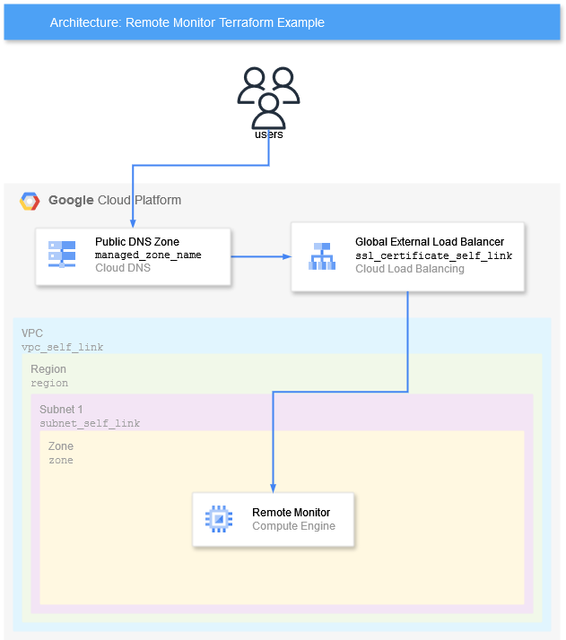

<!-- Copyright 2024-2025 Audinate Pty Ltd and/or its licensors -->

# Auto Licensing Example with DDM Discovery

This example illustrates how to deploy Remote Monitor. In the example, an application load balancer (ALB) is used to perform SSL termination for the HTTP server that runs in the Remote Monitor instance. It requires one global SSL certificate, and one DNS managed zone to create the A record in.



## Usage

To run this example you need to execute:

```bash
$ terraform init
$ terraform plan
$ terraform apply
```

Note that this example may create resources which cost money. Run `terraform destroy` when you don't need these resources.

<!-- BEGIN_TF_DOCS -->
## Requirements

| Name | Version |
|------|---------|
| <a name="requirement_terraform"></a> [terraform](#requirement\_terraform) | >= 1.8.3 |
| <a name="requirement_google"></a> [google](#requirement\_google) | >= 5.28.0 |

## Modules

| Name | Source | Version |
|------|--------|---------|
| <a name="module_remote_monitor"></a> [remote\_monitor](#module\_remote\_monitor) | ../../modules/remote-monitor | n/a |
| <a name="module_rm_firewall_rules"></a> [rm\_firewall\_rules](#module\_rm\_firewall\_rules) | ../../modules/common-modules/bridge/firewall | n/a |
| <a name="module_rm_image"></a> [rm\_image](#module\_rm\_image) | ../../modules/common-modules/gce/dante-linux-image | n/a |

## Resources

| Name | Type |
|------|------|
| [google_dns_record_set.cloud_dns_record](https://registry.terraform.io/providers/hashicorp/google/latest/docs/resources/dns_record_set) | resource |
| [google_compute_zones.available](https://registry.terraform.io/providers/hashicorp/google/latest/docs/data-sources/compute_zones) | data source |
| [google_dns_managed_zone.monitor_zone](https://registry.terraform.io/providers/hashicorp/google/latest/docs/data-sources/dns_managed_zone) | data source |

## Inputs

| Name | Description | Type | Default | Required |
|------|-------------|------|---------|:--------:|
| <a name="input_dns_domain"></a> [dns\_domain](#input\_dns\_domain) | (Optional) The domain name suffix of the DNS containing the DDM SRV discovery records. For example if the device SRV record is `default._dante-ddm-d._udp.my.domain.internal.` this should be `my.domain.internal.` | `string` | `null` | no |
| <a name="input_managed_zone_name"></a> [managed\_zone\_name](#input\_managed\_zone\_name) | The name of the managed DNS zone to place the Remote Monitor A record in. | `string` | n/a | yes |
| <a name="input_project"></a> [project](#input\_project) | The project ID of the GCP project the instances will be created in | `string` | n/a | yes |
| <a name="input_region"></a> [region](#input\_region) | Region the instances will be created in | `string` | n/a | yes |
| <a name="input_rm_firewall_tags"></a> [rm\_firewall\_tags](#input\_rm\_firewall\_tags) | (Optional) The set of firewall tags which should be applied to the Remote Monitor instance. If excluded, firewall rules will be created automatically. | `set(string)` | `null` | no |
| <a name="input_rm_image"></a> [rm\_image](#input\_rm\_image) | (Optional) The image used to initialise the Remote Monitor instance. This image must have the MULTI\_IP\_SUBNET guest os feature. If excluded, a new custom ubuntu image will be created. See https://registry.terraform.io/providers/hashicorp/google/latest/docs/resources/compute_instance#image-1 for format | `string` | `null` | no |
| <a name="input_rm_version"></a> [rm\_version](#input\_rm\_version) | (Optional) The version of Remote Monitor to be installed | `string` | `null` | no |
| <a name="input_ssl_certificate_self_link"></a> [ssl\_certificate\_self\_link](#input\_ssl\_certificate\_self\_link) | The self link of the global ssl certificate to be used in the load balancer. This can be determined using `gcloud compute ssl-certificates describe <your_certificate> --format='default(selfLink)'` | `string` | n/a | yes |
| <a name="input_subnet_self_link"></a> [subnet\_self\_link](#input\_subnet\_self\_link) | The subnet this instance will be associated with. The subnet's self link can be determined by running `gcloud compute networks subnets describe <subnet_name> --region=<region_name> --format='default(selfLink)'` | `string` | n/a | yes |
| <a name="input_vpc_self_link"></a> [vpc\_self\_link](#input\_vpc\_self\_link) | (Optional) The vpc for instance firewall rules to be created in. The VPC self link can be determined by running `gcloud compute networks describe <vpc_name> --format='default(selfLink)` | `string` | `null` | no |
| <a name="input_web_admin_email"></a> [web\_admin\_email](#input\_web\_admin\_email) | The admin email address to log in to Remote Monitor | `string` | n/a | yes |
| <a name="input_web_admin_password"></a> [web\_admin\_password](#input\_web\_admin\_password) | The admin password to log in to Remote Monitor | `string` | n/a | yes |
| <a name="input_zone"></a> [zone](#input\_zone) | (Optional) The zone the instances will be created in. If excluded, will select an available zone | `string` | `null` | no |
<!-- END_TF_DOCS -->
